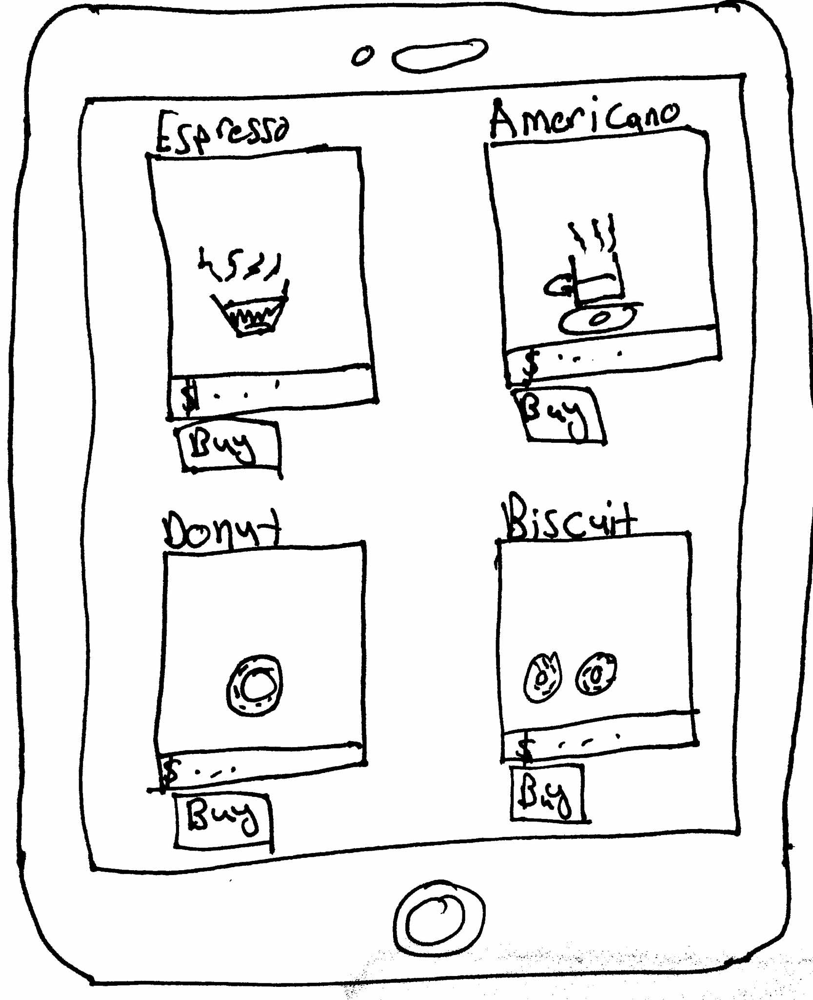

# Design

## What is it about?

The menu screen is used to show a list of available items a user can choose from to buy at the coffee shop. It's shown in a grid view so that they have an idea of what they're getting.

There is information about the price right below the image and the name of the item right above it. There is an option for the to place an order right below the item square.

## Actions for users to take

Users can scroll through the menu to choose what they want. They can press the buy button to place an order for that specific item.

## Design princples(s) applied

* People love to have choices, which makes them feel like they are in control.
* Too many choices would cause them to have trouble deciding what they want.

## Design rationale

* Made the number of item choices that appear on the screen at a given time to be less than 6.
* Should enough items at once to give users the ability to choose what they want.