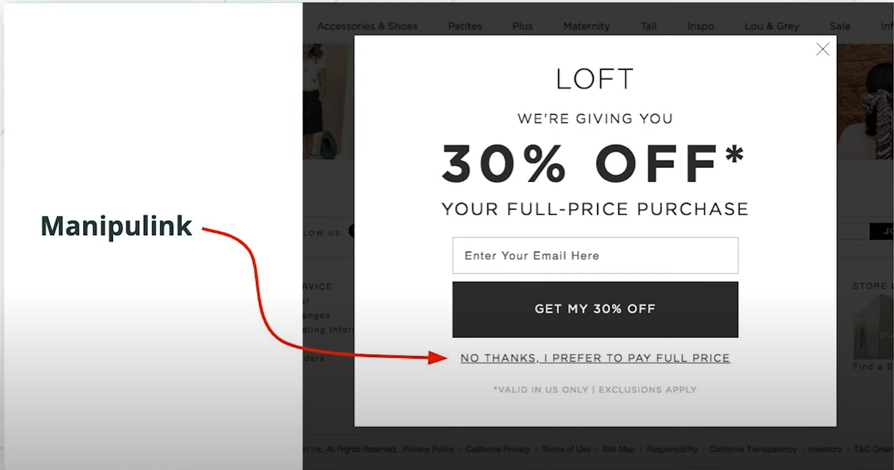

Users should be treated like normal humans, not like they are number or they have no idea at all.

# Manipulation and Negative Emotions

An example of how users are treated as if they can't think for themselves, is through the manipulink:

The point of this pop up is to make the user feel bad for not going through the flow the design wants.

Even if the design succeeds in manipulating a user to signing up for a service that they didn't want, the user won't have a fond experience with that product.

Some sites try to use a manipulink with urgency

If a user doesn't want to use a certain feature, their decision should be respected.

**Negative reinforcement** refers to removing the "punishment" to the user if they do as the design intends. It's an effective way to traumatize the user.

Negative emotions like shame or panic shouldn't be used when trying to get the user to do something.

The user's experience won't be good if they are forced to interact with something.

# Avoiding Clickbaits and False Alarams

The warning icon that is visible here:

Was to tell the user this message:

The warning icon should only be used to warn users of an important error, not something that should be a notification.

Raising false alarms just to get users to click on something should be avoided. (click baiting)

Obnoxious stimuli, like annoying sounds, to get a user to do something should be avoided.

# Customer-facing products Vs Enterprise products

Customer facing products are products designed for the public.

Enterprise products are products specially designed for a certain companies or a company environment.

Customer facing products usually have better UX because they have to compete in a highly competitive market where the better UX usually is more successful.

Enterprise products usually have worse UX because:

* Enterprise products are usually sold to the management and not to the employees. Employees have no choice but to use the purchased product.
* Enterprise products usually have complex business logic, which in turn makes it harder to design optimal UX because of the deeper components
* Enterprise products need users to have specific knowledge about the domain where it's being applied.

It's not always the case that enterprise products have worse UX that customer facing products, but these factors increase the difficulty for enterprise products have greate UX. 