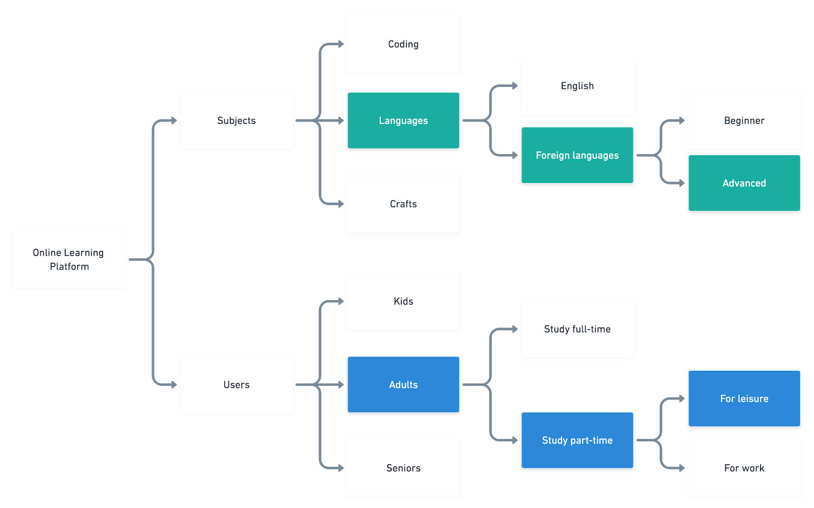
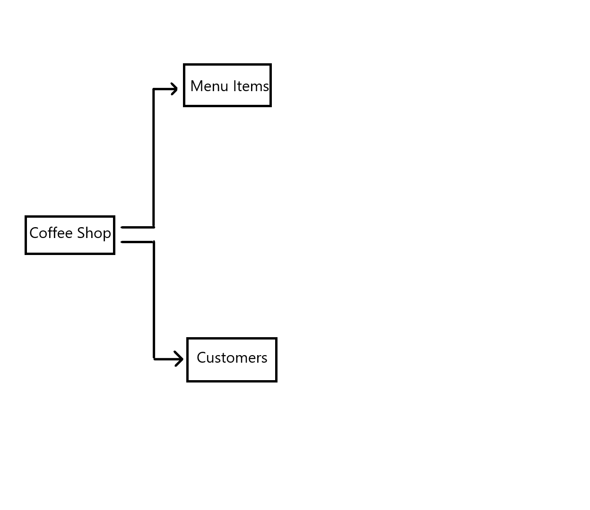

I will choose the udacity coffe shop app.

Possible features are:

* Students can place their drink orders
* Collaborate with other studens in the coffee shop
* Motivate progress on a nanodegree
* Facilate a productive study environment.

# Scoping the topic

Steps to take to scope the topic, since there isn't a lot of resources and time available:

1. **Choosing a domain/industry**
2. **Choosing a more niche market**
3. **Choosing a user group**: usually only one group.
4. **Narrowing down the users**
5. **Choosing a single critical user journey**
6. **The final scope**: which is the design problem after taking all of the previous steps

An exmaple of scoping a topic:

# My Choices for the final project

## Choosing brand domain

I chose the udacity coffee shop app.

## Dissect your topic

The udacity coffee shop app will be used by students of udacity, who are usually adults. Even though they can be both full-time or part-time students, I will go with those who study full-time for university.

The udacity coffee shop needs to provide certain beverages and small desserts. I will be focusing on coffees. Specifically, coffees that are made for the purpose of keeping students awake.

## Is It Doable?

yeah it's doable.