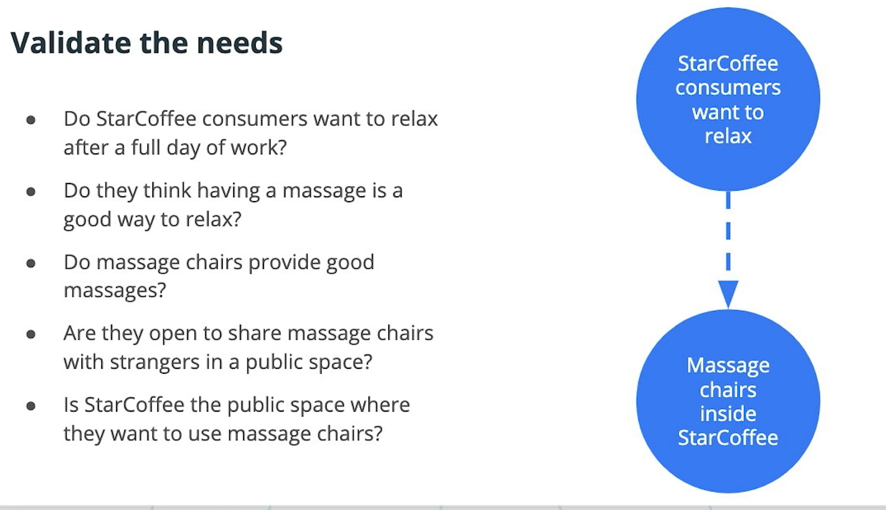

When introducing a solution to a valid user needm the designer needs to make sure that the type of user and the specific need for that user actually exist.

For example, a coffee shop may find out that most of the customers that drop by between 4-6 pm are customers arriving after they finished work. These customers often say that what they like to do is relax after work. So the owner decides to bring in a massage chair to help the customers relax. But the customers refuse to use that chair since it will be used by previous customers who might get it dirty with coffee and food.

This example is used to demonstrate that just because a problem may exist for a certain group of users, doesn't mean the solution can be served through the product.

The point of research is to make sure that a need actually exists for users for desiging a solution for that need. When conducting research, it's important to include questions that see if a user really needs or even wnats the thing that is going to be in the design.

Designers should vet the solution, the problem and the users before implementing a design screen.